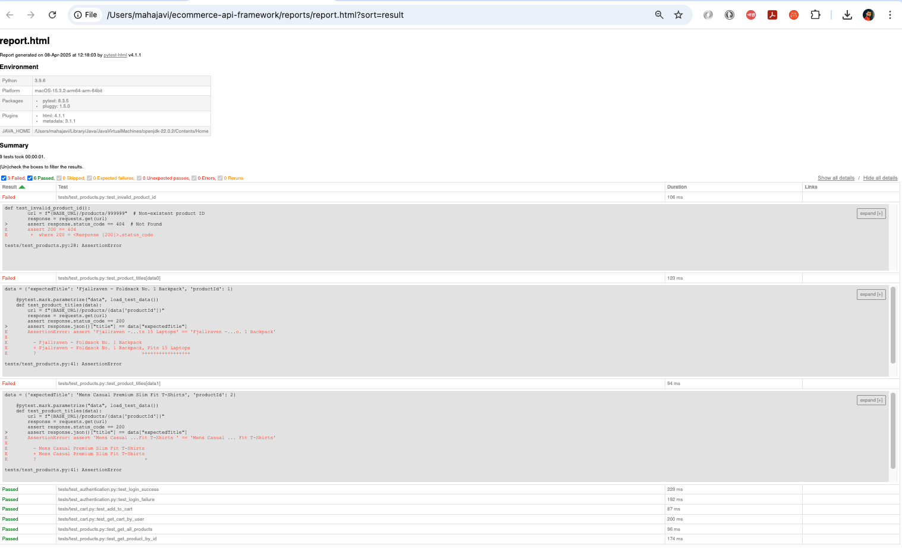

# Real-World E-Commerce API Testing

## Overview
This project tests the FakeStoreAPI, covering authentication, products, and cart functionality.

## Features Tested:
- Authentication (`/auth/login`)
- Products (`/products`)
- Cart (`/carts`)

## Tools Used:
- Pytest for automation.
- OWASP ZAP for security testing.
- Swagger/OpenAPI for contract validation.

## How to Run Tests:
1. Install dependencies: pip install -r requirements.txt
2. Run tests with HTML report generation: pytest --html=reports/report.html --self-contained-html

## Sample Test Report Screenshot:

